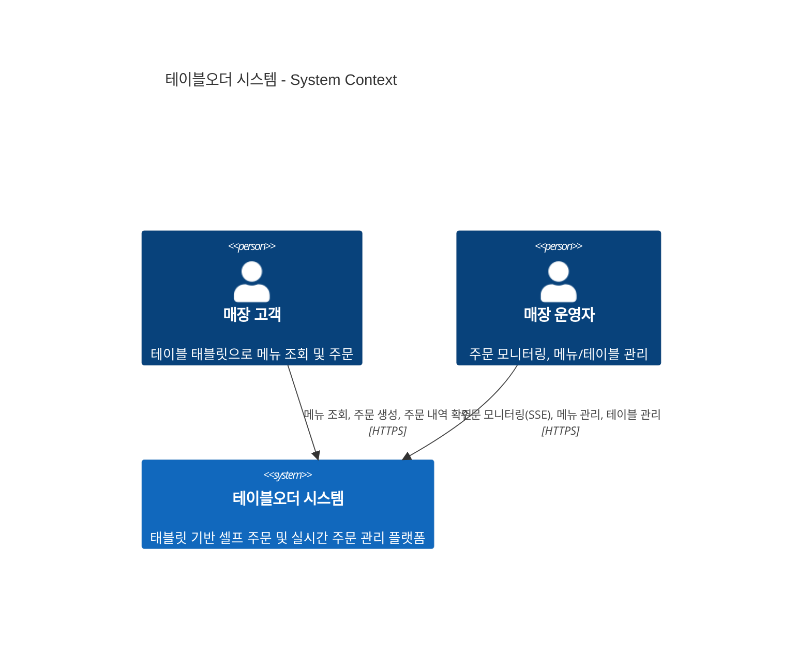
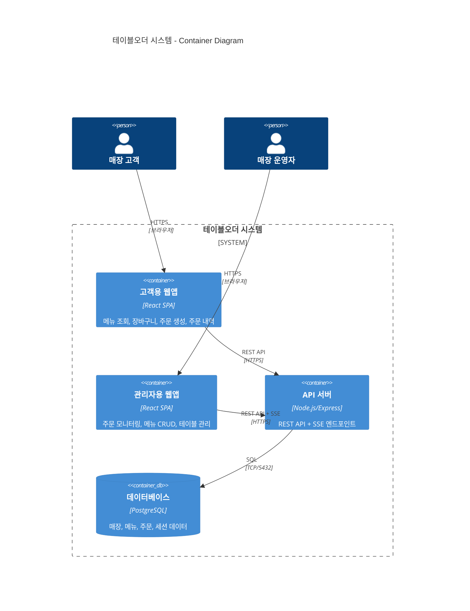

# Step 4: 하이레벨 아키텍처 설계 (C4 Model)

> 방법론: C4 Model (Context & Container)
> 상태: 완료

---

## 1. C4 Level 1 — System Context Diagram



### 외부 시스템

| 외부 시스템 | 연동 여부 | 비고 |
|------------|----------|------|
| PG/결제 시스템 | MVP 제외 | Won't Have |
| OAuth/OIDC 제공자 | MVP 제외 | 자체 JWT 인증 |
| SMS/이메일/푸시 | MVP 제외 | Won't Have |
| POS 시스템 | MVP 제외 | Won't Have |
| CDN | 선택적 | 정적 자산 서빙용 |

> **MVP에서는 외부 시스템 연동이 없습니다.** 자체 JWT 인증만 사용하며, 독립적으로 운영됩니다.

---

## 2. C4 Level 2 — Container Diagram



### 컨테이너 설명

| 컨테이너 | 기술 | 책임 | 비고 |
|----------|------|------|------|
| 고객용 웹앱 | React SPA | 메뉴 조회, 장바구니(로컬), 주문 생성, 내역 조회 | 태블릿 브라우저에서 실행 |
| 관리자용 웹앱 | React SPA | 실시간 대시보드(SSE), 메뉴 CRUD, 테이블 관리 | 데스크톱/태블릿 브라우저 |
| API 서버 | Node.js/Express | 비즈니스 로직, JWT 인증, SSE 이벤트 발행 | 단일 서버 인스턴스 (MVP) |
| 데이터베이스 | PostgreSQL | 영구 데이터 저장 | 매장/메뉴/주문/세션/이력 |

---

## 3. 아키텍처 스타일 결정

### 선택: 모놀리스 (Monolith)

| 기준 | 평가 |
|------|------|
| 팀 규모 | 1~3명 소규모 → 모놀리스 적합 |
| 도메인 복잡도 | 중간 (4개 도메인, Core 2개) → 모놀리스 충분 |
| 독립 배포 필요성 | 없음 (단일 매장 MVP) → 모놀리스 적합 |
| 확장성 요구 | 매장당 50 CCU → 수직 확장 충분 |
| 기술 다양성 | 불필요 (단일 스택) → 모놀리스 적합 |

### 선택 근거
1. **소규모 팀에 최적**: 배포/모니터링/디버깅 오버헤드 최소화
2. **단일 매장 MVP**: 분산 시스템의 복잡성이 가져다 주는 이점 없음
3. **빠른 개발 속도**: 프로세스 간 통신 없이 함수 호출로 충분
4. **운영 단순성**: 단일 프로세스 배포, 단일 DB

### 트레이드오프
- **장점**: 개발 속도, 배포 단순성, 디버깅 용이, 트랜잭션 관리 간단
- **단점**: 수평 확장 제한, 기술 스택 고정
- **수용한 리스크**: 멀티 매장 확장 시 모듈러 모놀리스 또는 서비스 분리 필요
- **완화 전략**: 도메인별 모듈 분리로 향후 분리 가능한 구조 유지

### 향후 진화 경로
```
[현재] 모놀리스 (MVP)
  ↓ 멀티 매장 확장 시
[다음] 모듈러 모놀리스 (도메인별 모듈 분리)
  ↓ 독립 스케일링 필요 시
[미래] 마이크로서비스 (주문/메뉴/인증 분리)
```

---

## 4. 통신 패턴 정의

| 패턴 | 용도 | 프로토콜 | 적용 대상 |
|------|------|---------|----------|
| **동기 REST** | CRUD 작업, 인증 | HTTPS + JSON | 메뉴 조회, 주문 생성, 로그인 |
| **SSE** | 서버→클라이언트 단방향 실시간 | HTTP Streaming | 신규 주문 알림, 주문 상태 변경 |

### SSE 선택 근거 (vs WebSocket)

| 기준 | SSE | WebSocket |
|------|-----|-----------|
| 방향성 | 서버→클라이언트 단방향 ✅ | 양방향 (불필요) |
| 복잡성 | HTTP 기반, 프록시 친화적 | 별도 프로토콜, 프록시 설정 필요 |
| 자동 재연결 | 브라우저 내장 ✅ | 직접 구현 필요 |
| 충분성 | 주문 알림은 단방향으로 충분 | 오버엔지니어링 |

---

## 5. 데이터 흐름도

### 5.1 고객 주문 흐름

```
[고객 태블릿]                [API 서버]              [DB]           [관리자 대시보드]
     │                          │                    │                    │
     ├── POST /orders ────────> │                    │                    │
     │                          ├── INSERT order ──> │                    │
     │                          │ <── order_id ───── │                    │
     │ <── 201 {order_id} ───── │                    │                    │
     │                          ├── SSE event ───────────────────────────>│
     │                          │   {type: "new_order", data: {...}}     │
     │                          │                    │                    │
```

### 5.2 관리자 주문 상태 변경 흐름

```
[관리자 대시보드]             [API 서버]              [DB]           [고객 태블릿]
     │                          │                    │                    │
     ├── PATCH /orders/:id ───> │                    │                    │
     │   {status: "preparing"}  ├── UPDATE order ──> │                    │
     │                          │ <── updated ─────  │                    │
     │ <── 200 OK ───────────── │                    │                    │
     │                          │   (상태 반영)       │                    │
```

### 5.3 테이블 세션 라이프사이클

```
[세션 없음] ──(첫 주문 생성)──> [세션 활성] ──(이용완료)──> [세션 종료]
                                    │                         │
                                    │ 주문 N건 누적            │ 주문 → 과거 이력 이동
                                    │ 총 주문액 갱신           │ 현재 주문/총액 = 0
                                    └─────────────────────────┘
```

---

## 6. 가용 영역(AZ) 배치 전략

### MVP 배치: 단일 인스턴스

```
┌─────────────────────────────────┐
│  AWS / Cloud (Single Region)    │
│                                 │
│  ┌───────────────────────────┐  │
│  │  AZ-a                     │  │
│  │                           │  │
│  │  ┌─────────┐ ┌────────┐  │  │
│  │  │ API서버  │ │ DB(PG) │  │  │
│  │  │ +React  │ │ 단일    │  │  │
│  │  │ Static  │ │ 인스턴스│  │  │
│  │  └─────────┘ └────────┘  │  │
│  │                           │  │
│  └───────────────────────────┘  │
│                                 │
└─────────────────────────────────┘
```

- **근거**: 단일 매장 MVP, 99.5% SLO, 비용 최적화
- **SPOF**: API 서버, DB (수용 가능 — MVP)
- **장애 조치**: 수동 재시작 (RTO 30분 이내)
- **향후**: 멀티 매장 시 Multi-AZ + DB 리플리카 도입

---

## 7. 핵심 질문 체크리스트

- [x] 모든 외부 시스템과의 연동 지점이 식별되었는가? → MVP에서 외부 연동 없음 (확인 완료)
- [x] 컨테이너 간 통신 프로토콜이 명확한가? → REST (CRUD) + SSE (실시간)
- [x] 아키텍처 스타일이 팀 규모/역량에 적합한가? → 모놀리스 (소규모 팀 최적)
- [x] 장애 조치 전략이 NFR의 가용성 요구사항을 충족하는가? → RTO 30분, 99.5% 충족
- [x] 확장 지점(Scaling Point)이 식별되었는가? → SSE 연결 수, DB 커넥션이 핵심 확장 지점

---

## 8. 다음 단계

이 산출물은 다음 단계들의 입력으로 전달됩니다:
- **아키텍처 다이어그램** → Step 5 (기술 스택 선정)
- **컨테이너 구조** → Step 6 (데이터 모델링)
- **통신 패턴** → Step 7 (API 설계)
- **AZ 배치** → Step 9 (인프라 전략)
