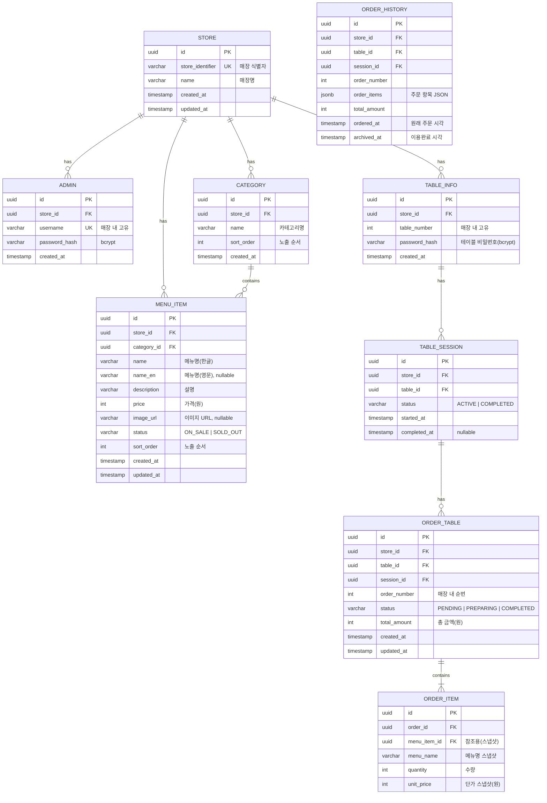

# Step 6: 데이터 모델링 및 DDD 매핑 (Aggregates)

> 방법론: Event Storming, DDD Tactical Design
> 상태: 완료

---

## 1. 이벤트 스토밍 (Event Storming)

### 도메인 이벤트 (시간순)

| # | 이벤트 | 발생 조건 | 관련 도메인 |
|---|--------|----------|------------|
| 1 | 테이블 로그인됨 (TableLoggedIn) | 테이블 태블릿에서 인증 성공 | 인증 |
| 2 | 메뉴 조회됨 (MenuViewed) | 고객이 메뉴 목록 요청 | 메뉴 관리 |
| 3 | 장바구니에 추가됨 (ItemAddedToCart) | 고객이 "담기" 클릭 | 주문 관리 (클라이언트) |
| 4 | 주문 생성됨 (OrderCreated) | 고객이 "주문 확정" 클릭 | 주문 관리 |
| 5 | 세션 시작됨 (SessionStarted) | 테이블의 첫 주문 생성 | 테이블 세션 |
| 6 | 주문 상태 변경됨 (OrderStatusChanged) | 관리자가 상태 변경 | 주문 관리 |
| 7 | 주문 삭제됨 (OrderDeleted) | 관리자가 직권 삭제 | 주문 관리 |
| 8 | 세션 종료됨 (SessionCompleted) | 관리자가 "이용완료" 클릭 | 테이블 세션 |
| 9 | 주문 이력 이동됨 (OrdersArchivedToHistory) | 세션 종료 후 | 테이블 세션 |
| 10 | 메뉴 등록됨 (MenuItemCreated) | 관리자가 메뉴 추가 | 메뉴 관리 |
| 11 | 메뉴 수정됨 (MenuItemUpdated) | 관리자가 메뉴 수정 | 메뉴 관리 |
| 12 | 메뉴 삭제됨 (MenuItemDeleted) | 관리자가 메뉴 삭제 | 메뉴 관리 |
| 13 | 메뉴 상태 변경됨 (MenuStatusChanged) | 관리자가 품절/판매중 전환 | 메뉴 관리 |
| 14 | 관리자 로그인됨 (AdminLoggedIn) | 관리자 인증 성공 | 인증 |

### 커맨드 → 이벤트 매핑

| 액터 | 커맨드 | → 이벤트 |
|------|--------|---------|
| 고객 | 테이블 로그인 | → TableLoggedIn |
| 고객 | 메뉴 조회 | → MenuViewed |
| 고객 | 장바구니 담기 | → ItemAddedToCart (클라이언트) |
| 고객 | 주문 확정 | → OrderCreated |
| 관리자 | 매장 로그인 | → AdminLoggedIn |
| 관리자 | 주문 상태 변경 | → OrderStatusChanged |
| 관리자 | 주문 삭제 | → OrderDeleted |
| 관리자 | 이용완료 | → SessionCompleted → OrdersArchivedToHistory |
| 관리자 | 메뉴 등록 | → MenuItemCreated |
| 관리자 | 메뉴 수정 | → MenuItemUpdated |
| 관리자 | 메뉴 삭제 | → MenuItemDeleted |
| 관리자 | 메뉴 상태 변경 | → MenuStatusChanged |

### 정책 (자동 규칙)

| When (이벤트) | Then (커맨드) | 설명 |
|--------------|-------------|------|
| OrderCreated (테이블 첫 주문) | 세션 시작 | 세션이 없으면 자동 생성 |
| SessionCompleted | 주문 이력 이동 | 현재 주문 → OrderHistory로 아카이빙 |
| SessionCompleted | 테이블 초기화 | 현재 주문 목록/총액 = 0 |

### 읽기 모델

| 읽기 모델 | 사용자 | 필요 데이터 |
|----------|--------|------------|
| 메뉴 목록 | 고객 | 카테고리별 메뉴 (이름, 가격, 설명, 상태) |
| 주문 내역 | 고객 | 현재 세션 주문 (번호, 시각, 메뉴, 금액, 상태) |
| 대시보드 | 관리자 | 테이블별 주문 현황 (SSE 실시간) |
| 과거 이력 | 관리자 | 세션별 과거 주문 (날짜 필터) |

---

## 2. DDD 전술적 설계

### 2.1 엔티티 vs 값 객체

#### 엔티티 (고유 식별자로 구별)

| 엔티티 | 식별자 | 생명주기 | 불변 규칙 |
|--------|--------|---------|----------|
| Store | storeId (UUID) | 생성~삭제 | 매장 식별자 고유성 |
| Admin | adminId (UUID) | 생성~삭제 | 매장당 관리자 계정 |
| Table | tableId (UUID) | 생성~삭제 | 매장 내 테이블 번호 고유성 |
| MenuItem | menuItemId (UUID) | 생성~삭제 | 메뉴명+매장 고유성 |
| Category | categoryId (UUID) | 생성~삭제 | 카테고리명+매장 고유성 |
| Order | orderId (UUID) | 생성~완료/삭제 | 주문 상태 전이 규칙 |
| TableSession | sessionId (UUID) | 시작~종료 | 테이블당 활성 세션 최대 1개 |
| OrderHistory | historyId (UUID) | 생성 (불변) | 변경 불가 (아카이브) |

#### 값 객체 (속성 값으로 동등성 판단)

| 값 객체 | 속성 | 불변성 | 예시 |
|---------|------|--------|------|
| Money | amount (integer, 원 단위) | 완전 불변 | Money(15000) |
| OrderStatus | value (enum) | 완전 불변 | OrderStatus.PENDING |
| MenuStatus | value (enum) | 완전 불변 | MenuStatus.ON_SALE |
| OrderItem | menuItemId, name, quantity, unitPrice | 완전 불변 | OrderItem("치킨", 2, 18000) |
| TableCredential | storeId, tableNumber, password | 완전 불변 | 로그인용 |

### 2.2 애그리거트 설계

#### Aggregate 1: Order (주문)
- **루트 엔티티**: Order
- **포함 값 객체**: OrderItem[], OrderStatus, Money (totalAmount)
- **불변 규칙 (Invariants)**:
  - 주문 총액 = 모든 OrderItem의 (unitPrice × quantity) 합
  - 주문 상태 전이: PENDING → PREPARING → COMPLETED (역방향 불가)
  - 최소 1개 이상의 OrderItem 필수
  - 삭제 시 전체 주문 삭제 (부분 삭제 불가)
- **외부 참조 (ID)**: storeId, tableId, sessionId

#### Aggregate 2: TableSession (테이블 세션)
- **루트 엔티티**: TableSession
- **포함 값 객체**: 없음
- **불변 규칙 (Invariants)**:
  - 테이블당 활성 세션 최대 1개
  - 세션 종료 시 해당 세션의 모든 주문이 아카이빙되어야 함
  - 세션 ID는 주문 생성 시 참조됨
- **외부 참조 (ID)**: storeId, tableId

#### Aggregate 3: MenuItem (메뉴)
- **루트 엔티티**: MenuItem
- **포함 값 객체**: Money (price), MenuStatus
- **불변 규칙 (Invariants)**:
  - 가격 > 0
  - 메뉴명 필수 (한글)
  - 카테고리 필수
- **외부 참조 (ID)**: storeId, categoryId

#### Aggregate 4: Store (매장)
- **루트 엔티티**: Store
- **포함 엔티티**: Admin, Table[]
- **불변 규칙 (Invariants)**:
  - 매장 식별자 고유
  - 매장 내 테이블 번호 고유
- **외부 참조 (ID)**: 없음 (루트)

---

## 3. 바운디드 컨텍스트 지도

### 컨텍스트 목록

| 컨텍스트 | 도메인 유형 | 핵심 애그리거트 | 모듈 경로 |
|----------|------------|---------------|----------|
| 주문 컨텍스트 (Order) | Core | Order | /modules/order |
| 세션 컨텍스트 (Session) | Core | TableSession | /modules/session |
| 메뉴 컨텍스트 (Menu) | Supporting | MenuItem, Category | /modules/menu |
| 매장 컨텍스트 (Store) | Supporting | Store, Admin, Table | /modules/store |
| 인증 컨텍스트 (Auth) | Generic | - (JWT 유틸리티) | /modules/auth |

### 컨텍스트 간 관계 (Context Map)

```
┌──────────┐    Conformist     ┌──────────┐
│ 메뉴 관리 │ ────────────────> │ 주문 관리 │
│ (Menu)   │  메뉴명/가격 참조   │ (Order)  │
└──────────┘                   └──────────┘
                                    │
                               ID 참조만
                                    │
┌──────────┐    Conformist     ┌──────────┐
│ 매장 관리 │ ────────────────> │ 세션 관리 │
│ (Store)  │  테이블 ID 참조    │ (Session)│
└──────────┘                   └──────────┘
      │                             │
      │ Open Host Service           │ ID 참조
      ↓                             ↓
┌──────────┐                   ┌──────────┐
│ 인증     │                   │ 주문 관리 │
│ (Auth)   │                   │ (Order)  │
└──────────┘                   └──────────┘
```

| 업스트림 | 다운스트림 | 관계 패턴 | 설명 |
|----------|----------|----------|------|
| 메뉴 (Menu) | 주문 (Order) | Conformist | 주문 생성 시 메뉴명/가격을 스냅샷으로 복사 |
| 매장 (Store) | 세션 (Session) | Conformist | 테이블 ID를 세션에서 참조 |
| 매장 (Store) | 인증 (Auth) | Open Host Service | 매장/관리자/테이블 인증 정보 제공 |
| 세션 (Session) | 주문 (Order) | Conformist | 주문 생성 시 세션 ID 참조 |

---

## 4. ERD (Entity-Relationship Diagram)



### 설계 원칙

| 원칙 | 적용 |
|------|------|
| 정규화 | 3NF 기본 |
| 가격 스냅샷 | OrderItem에 주문 시점 가격 저장 (메뉴 가격 변경 무관) |
| 메뉴명 스냅샷 | OrderItem에 주문 시점 메뉴명 저장 |
| 주문 이력 | JSON 형태로 비정규화 저장 (읽기 전용, 변경 없음) |
| UUID | 모든 PK에 UUID 사용 (순번은 order_number로 별도 관리) |
| soft delete | 사용하지 않음 (주문 삭제 = 물리 삭제, 이력은 별도 테이블) |

### 인덱스 전략

| 테이블 | 인덱스 | 용도 |
|--------|--------|------|
| ORDER_TABLE | (store_id, session_id, created_at) | 세션별 주문 조회 |
| ORDER_TABLE | (store_id, status) | 상태별 주문 필터 |
| MENU_ITEM | (store_id, category_id, sort_order) | 카테고리별 메뉴 조회 |
| TABLE_SESSION | (store_id, table_id, status) | 활성 세션 조회 |
| ORDER_HISTORY | (store_id, table_id, archived_at) | 과거 이력 조회 |
| ADMIN | (store_id, username) | 관리자 로그인 |
| TABLE_INFO | (store_id, table_number) | 테이블 로그인 |

---

## 5. 핵심 질문 체크리스트

- [x] 모든 애그리거트의 불변 규칙이 명확한가? → 4개 애그리거트 모두 Invariants 정의 완료
- [x] 애그리거트 간 참조가 ID만으로 이루어지는가? → storeId, tableId, sessionId, categoryId
- [x] 바운디드 컨텍스트 경계가 도메인 맵과 일치하는가? → Step 1 도메인 맵과 5개 컨텍스트 매핑
- [x] 컨텍스트 간 관계 패턴이 적절한가? → Conformist, Open Host Service 적용
- [x] 이벤트 발행/구독 관계가 정의되었는가? → 14개 도메인 이벤트, 3개 정책 정의
- [x] 정규화 수준과 성능 트레이드오프가 결정되었는가? → 3NF 기본, OrderHistory만 비정규화

---

## 6. 다음 단계

이 산출물은 다음 단계들의 입력으로 전달됩니다:
- **ERD** → Step 7 (API 설계의 리소스 모델)
- **바운디드 컨텍스트** → Step 7 (API 경계)
- **도메인 이벤트** → Step 7 (SSE 이벤트 설계)
- **애그리거트** → Step 8 (디자인 패턴 적용)
